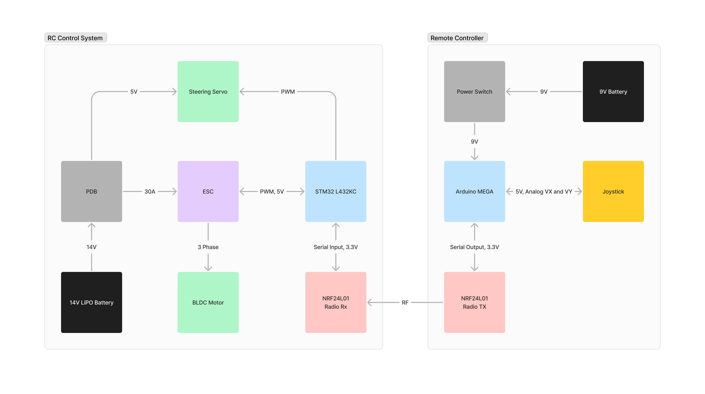

# RC Car

The firmware for a STM32-based RC car.
The car can be controlled wirelessly via an Arduino-based RC controller.
Radio communication is done via NRF24L01 radio modules.

## Control System Overview



## Initialization Guide

```bash
git clone https://github.com/irvingywang/RC_CAR.git
```
